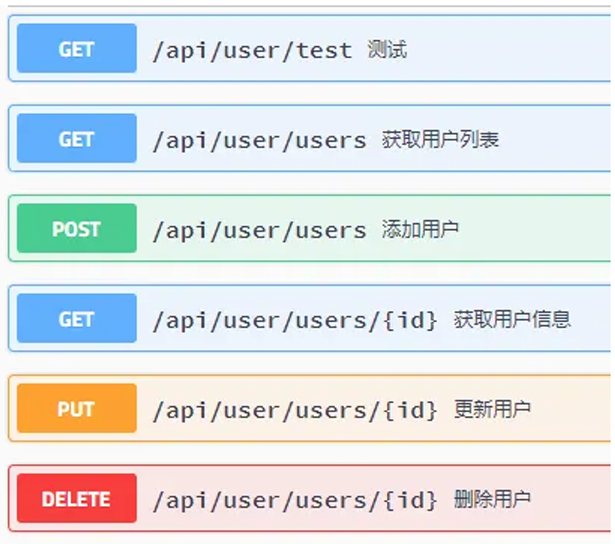

功能模块

1. 用户模块 *user*
2. 相册模块 *album*
3. 链接模块 *link*
4. 留言模块 *message*
5. 博客模块 *blog*


生成迁移文件

`python manage.py makemigrations [appname]`


接口开发（*Restful*规范）



在开发服务器上运行Django项目时，媒体文件的处理方式与生产环境有所不同。
Django的开发服务器在默认设置下不会自动为您提供媒体文件。
为了在开发服务器上访问媒体文件，需要进行以下配置:
1. 首先，确保您已经在项目的urls.py文件中包含了以下代码：
```
from django.conf import settings
from django.conf.urls.static import static

urlpatterns = [
    # ... 其他URL配置
] + static(settings.MEDIA_URL, document_root=settings.MEDIA_ROOT)
```
2. 创建Django项目时，需要在设置文件中配置媒体文件的路径。在该文件中，有两个重要的变量需要设置：
```
MEDIA_URL = '/media/'
MEDIA_ROOT = os.path.join(BASE_DIR, 'media')

# (MEDIA_URL是指在网站上访问媒体文件的URL路径，而MEDIA_ROOT是媒体文件在服务器上的实际存储路径。)
```
